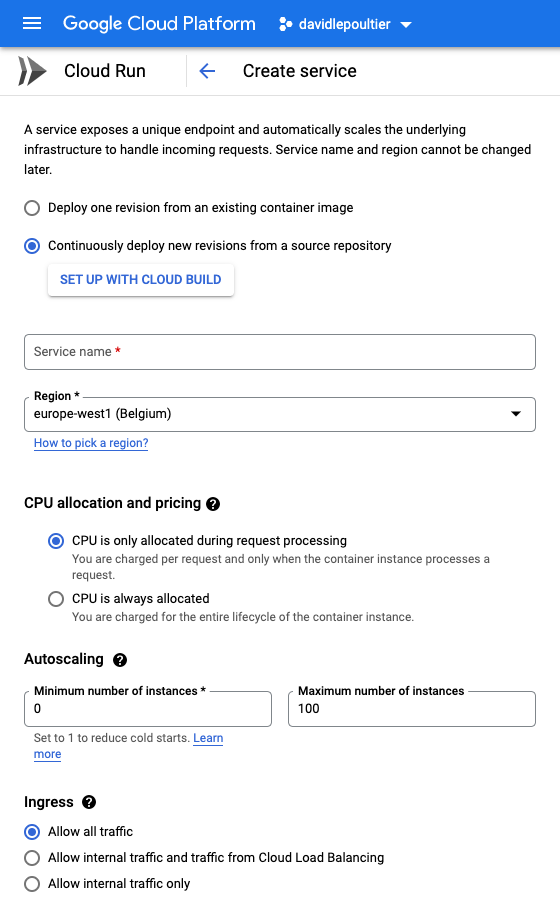
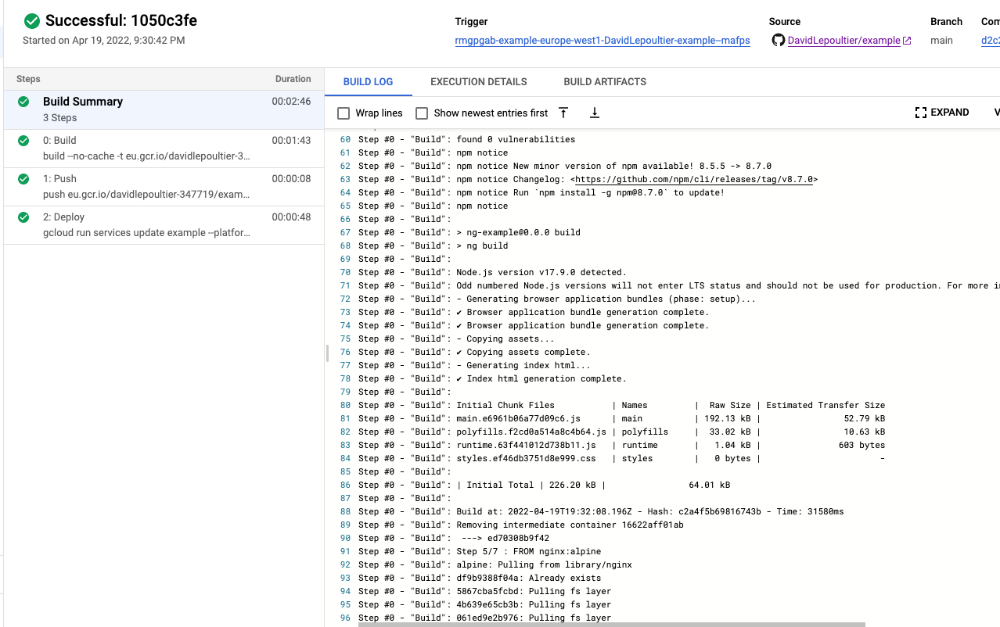
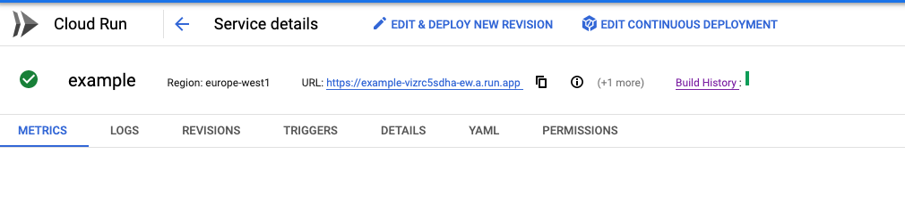
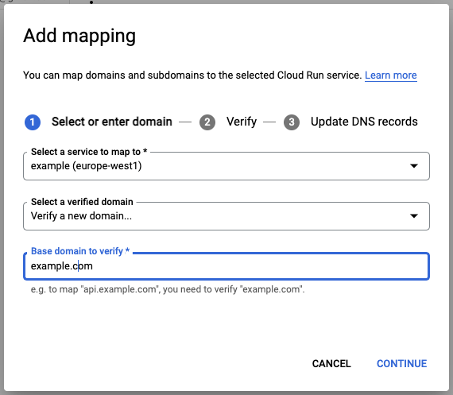

# NgExample

This project was generated with [Angular CLI](https://github.com/angular/angular-cli) version 13.3.3.

This project is used to explained how to deploy an Angular Frontend to **Google Cloud run**

## Prerequis

* You must have an active **Google Cloud Platform** account. You can create a new one and test **for free 90 days**

### Update your repository git

Create new files in your repository git:

* Dockerfile
* .dockerignore

#### Dockerfile content

This Dockerfile will be used by Google to create a docker container for your Angular Application.

Set your Dockerfile like this:

```yaml
# stage 1

FROM node:alpine AS build
WORKDIR /app
COPY . .
RUN npm ci && npm run build

# stage 2

FROM nginx:alpine
COPY --from=build /app/dist/ng-example /usr/share/nginx/html
EXPOSE 80

```

* The stage 1 build your Angular Application
* The stage 2 copy the build into a nginx container. It's this container that will be used by Google to expose your application.

#### .dockerignore

Same usage as .gitignore, but for docker

```yaml
node_modules
.angular
```

### Push new files

Push the new files in your repository.

```Shell
git add .
git commit -m "Add Dockerfile and .dockerignore"
git push
```

## Deploy your application

### Cloud Run

Connect you to [GCP Cloud Run](https://console.cloud.google.com/run), and create a service.

#### Create Service



* Select Continuously deploy new revisions
  * Link you github account with your GCP account
  * Select your repository
  * Set you main branch (main|master)
  * Build Type, select Dockerfile
  * Save

* Region: Select europe-west1 (low cost region)

Expand **Container, Vairables & Secrets, Connections, Security**
In the tab **CONTAINER** set:

* Container port: 80
* Memory: 256 MiB
* CPU: 1

Then click on **CREATE**

During the creation service, you can follow the build logs from [Build History](https://console.cloud.google.com/cloud-build)



At the end you can access to your application from the link in the service description.



#### Manage custome domains

You can manage a custome domain to expose your service with a personnal url. From **Cloud Run**, go to **MANAGE CUSTOM DOMAINS**. And **ADD MAPPING**



* Select your service
* Select Verify a new domain
* Your domain to verify.

During the verification process, you will link your GCP account and your DNS provider account.

## Deploy new version

A new deployment will be trigger at each commit do on the main branch set in your Cloud Run Service.

!!! warning Don't do over push your main branch. Work in another branch and merge when everything look ok !!!
